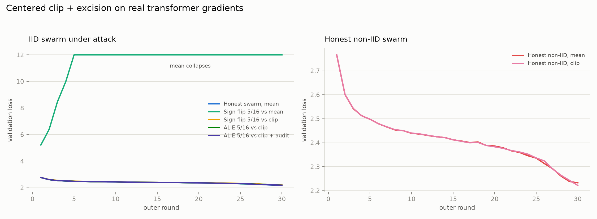
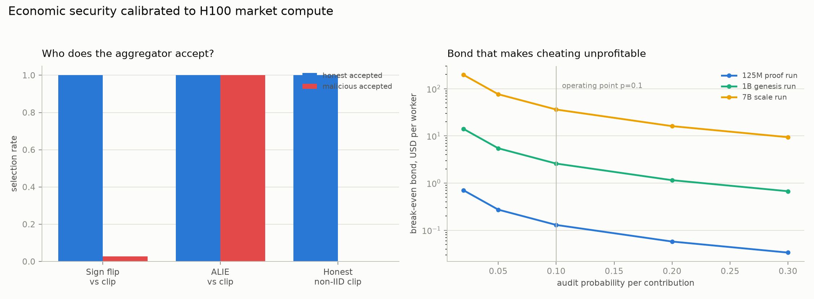

# Leviathan

Trustless training for the People's model.

Frontier AI is produced inside five balance sheets. The mathematics of training over the open internet is solved and shipping; what remains unsolved is trust. Nobody has made it safe to accept a gradient from a stranger and pay them for it.

Leviathan is a Solana-coordinated training network where anyone with a GPU joins by posting a bond, earns Proof of Gradient for contributions that survive verification, and loses the bond if they lie. The chain carries commitments, audits and money. The mesh carries compressed tensors. The model belongs to the network that trained it.

Hobbes drew Leviathan as a giant composed of thousands of individuals. This one is composed of thousands of GPUs.

## The open slot

Every live network picked one column. Nobody picked both:

| | Verification guarantees | Live economics (bonds, slashing) |
|---|---|---|
| Bittensor training subnets | scoring gates, admitted gaps | emissions only, no bonds |
| Nous Psyche | witness liveness, verifier is a `todo!()` | no stake, dead slash code, whitelist |
| Gensyn Verde | strong, FP32 single-GPU determinism | pre-mainnet |
| OVIG | tolerance-band replay audits | paper, not a network |
| Leviathan | OVIG-style replay audits | bonds sized (1-p)/p, live slashing |

Three security layers, each covering the others' gap: robust aggregation bounds damage in the round it happens, random replay audits price lying, bonds make sybil a cost. Economic security with published parameters, never a cryptographic overclaim.

## Phase 0 results

30 outer rounds, 16 workers, a 5/16 Byzantine coalition, real gradients from an 826k-parameter GPT:

| scenario | final val loss | outcome |
|---|---|---|
| Honest swarm, mean | 2.175 | reference |
| Sign flip 5/16 vs mean | 12.0, diverged | naive aggregation destroyed |
| Sign flip 5/16 vs clip + excision | 2.203 | neutralized; malicious acceptance 3% |
| ALIE 5/16 vs clip | 2.190 | stealth coalition accepted 100%, damage 0.7% |
| ALIE 5/16 vs clip + audit p=0.1 | 2.194 | all 5 cheaters slashed |
| Honest non-IID, clip | 2.222 | zero honest false positives |



The break-even bond law held on a real transformer run: at audit probability p = 0.1 the theoretical expected catch time is 1/p = 10 rounds, and the observed mean across the five convictions was 9.8 rounds. Robust aggregation bounds what a coalition can do while it lives; the audit lottery ends its life on schedule.



## Phase 1 progress

The network substrate is a private fork of PsycheFoundation/nousnet (Apache-2.0) at wienerlabs/leviathan-net, carrying the layer upstream designed but left unimplemented: bonds, replay audits, slashing.

- 1.1 Fork bootstrap: mirror live, chain-side crates compile clean, upstream memnet suite 14/14 with no validator
- 1.2 Code map: docs/CODEMAP.md; dead code confirmed at file:line (verifier dispatch is a todo, Ejected never set, slashed never read), bond attach points locked
- 1.3 Devnet deployment under our own program IDs: coordinator JD9rHTiqBFgHjViWZc7gFZX74LvKKysbLbqFRaFvtmmN, authorizer 2Kg5ERG6ubuzyPmQ24axsws7V2ja2EvWp5CHMKFCrTxv, treasurer 9A1kc8Dr9dFJW9t1npAk7EHrADm6TAyFeVLH27CDdvv8; permissionless run leviathan-dev live in WaitingForMembers through the treasurer CPI path
- Next: 1.4 bond custody in the treasurer, then the audit lottery, dispute-driven slashing, the verifier daemon, and the recorded conviction demo

## This repository

Phase 0: the proof that the security economics survive contact with real transformer gradients.

| path | contents |
|---|---|
| `sim/` | Condorcet's aggregation, attack and staking layers ported from NumPy blobs to a real GPT trained by a 16-worker swarm: centered clip + excision vs sign-flip and ALIE coalitions, stake ledger with replay audits, break-even bond calibration against H100 market cost |
| `docs/WHITEPAPER.md` | thesis, protocol, security model, economics, honest limitations |
| `docs/DECISIONS.md` | prior-art sweep and the six locked decisions, sources inline |
| `docs/ARCHITECTURE.md` | on-chain programs, daemons, round lifecycle, determinism strategy |
| `docs/PRD.md`, `docs/TASKS.md` | phase acceptance criteria and the task ladder |

Reproduce the sim:

```
cd sim
uv sync
PYTORCH_ENABLE_MPS_FALLBACK=1 uv run python -m leviathan_sim.run --rounds 30
```

## Lineage

Built on the shoulders of, and differentiated from: Psyche/nousnet (Apache-2.0 fork substrate: Solana coordinator, iroh P2P, Rust DisTrO), SparseLoCo (MIT compression recipe), TOPLOC (MIT inference verification), OVIG (the audit loop's academic validation), Condorcet (wienerlabs: the aggregation and bond-economics research core), DanteGPU (supply), Wienerpad (futarchy governance), zk-lokomotive (Arweave rail).

Private under wienerlabs while Phase 1 lands.
