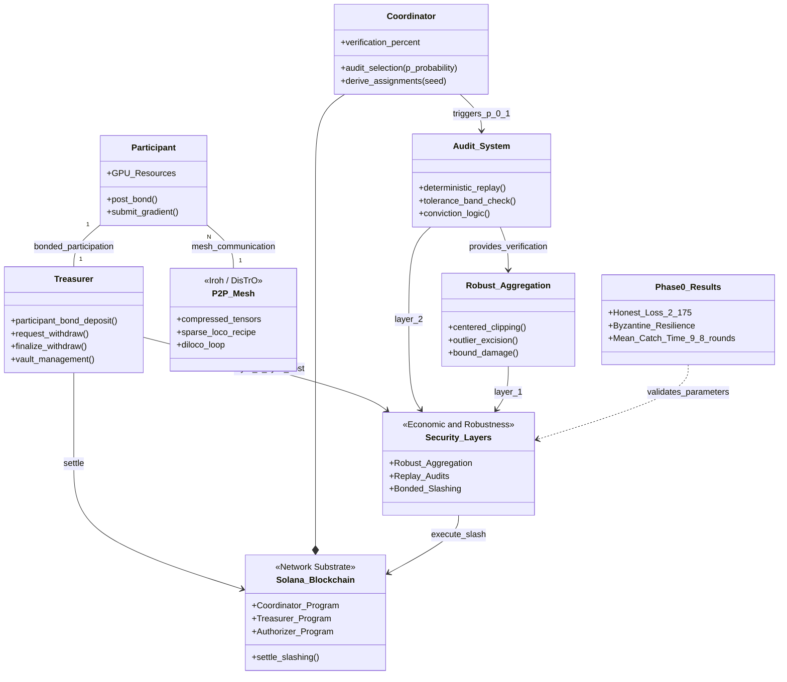
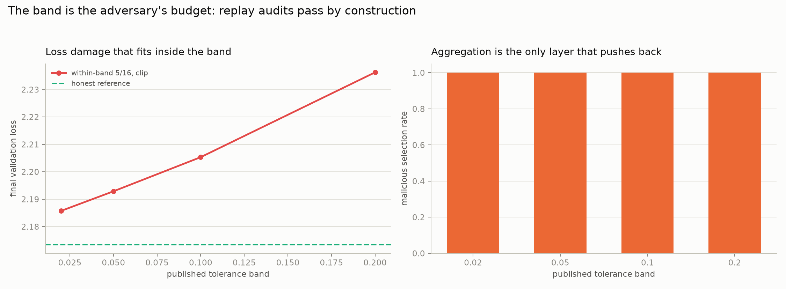

# Leviathan

Trustless training for the People's model.

Frontier AI is produced inside five balance sheets. The mathematics of training over the open internet is solved and shipping; what remains unsolved is trust. Nobody has made it safe to accept a gradient from a stranger and pay them for it.

Leviathan is a Solana-coordinated training network where anyone with a GPU joins by posting a bond, earns Proof of Gradient for contributions that survive verification, and loses the bond if they lie. The chain carries commitments, audits and money. The mesh carries compressed tensors. The model belongs to the network that trained it.

Hobbes drew Leviathan as a giant composed of thousands of individuals. This one is composed of thousands of GPUs.

## The open slot

Every live network picked one column. Nobody picked both:

| | Verification guarantees | Live economics (bonds, slashing) |
|---|---|---|
| Bittensor training subnets | scoring gates, admitted gaps | emissions only, no bonds |
| Nous Psyche | witness liveness, verifier is a `todo!()` | no stake, dead slash code, whitelist |
| Gensyn Verde | strong, FP32 single-GPU determinism | pre-mainnet |
| OVIG | tolerance-band replay audits | paper, not a network |
| Leviathan | OVIG-style replay audits | bonds sized (1-p)/p, live slashing |

Three security layers, each covering the others' gap: robust aggregation bounds damage in the round it happens, random replay audits price lying, bonds make sybil a cost. Economic security with published parameters, never a cryptographic overclaim.

## Architecture



## Phase 0 results

30 outer rounds, 16 workers, a 5/16 Byzantine coalition, real gradients from an 826k-parameter GPT:

| scenario | final val loss | outcome |
|---|---|---|
| Honest swarm, mean | 2.175 | reference |
| Sign flip 5/16 vs mean | 12.0, diverged | naive aggregation destroyed |
| Sign flip 5/16 vs clip + excision | 2.203 | neutralized; malicious acceptance 3% |
| ALIE 5/16 vs clip | 2.190 | stealth coalition accepted 100%, damage 0.7% |
| ALIE 5/16 vs clip + audit p=0.1 | 2.194 | all 5 cheaters slashed |
| Honest non-IID, clip | 2.222 | zero honest false positives |


The break-even bond law held on a real transformer run: at audit probability p = 0.1 the theoretical expected catch time is 1/p = 10 rounds, and the observed mean across the five convictions was 9.8 rounds. Robust aggregation bounds what a coalition can do while it lives; the audit lottery ends its life on schedule.


The published tolerance band is, by construction, the adversary's undetectable budget — so the sim prices it. A 5/16 coalition biasing against the honest mean at 0.9x the band passes every replay audit (measured distance exactly 0.9x band, zero fraud verdicts) and is fully accepted by the aggregator; what it buys is the damage curve below. At the operating band of 0.05 the whole coalition purchases +0.019 final loss against the 2.173 honest reference, about 0.9%, and the cost grows roughly linearly with band width. That number is why the band is a published dashboard metric and why calibrating it tightly per hardware class is a Genesis-gating task.



## Phase 1 progress

The network substrate is a private fork of PsycheFoundation/nousnet (Apache-2.0) at wienerlabs/leviathan-net, carrying the layer upstream designed but left unimplemented: bonds, replay audits, slashing.

- 1.1 Fork bootstrap: mirror live, chain-side crates compile clean, upstream memnet suite 14/14 with no validator
- 1.2 Code map: docs/CODEMAP.md; dead code confirmed at file:line (verifier dispatch is a todo, Ejected never set, slashed never read), bond attach points locked
- 1.3 Devnet deployment under our own program IDs: coordinator JD9rHTiqBFgHjViWZc7gFZX74LvKKysbLbqFRaFvtmmN, authorizer 2Kg5ERG6ubuzyPmQ24axsws7V2ja2EvWp5CHMKFCrTxv, treasurer 9A1kc8Dr9dFJW9t1npAk7EHrADm6TAyFeVLH27CDdvv8
- 1.4 Bonded participation in the treasurer: deposit, challenge-window withdraw, and settlement that forfeits slashed collateral into the run vault
- 1.5 Audit lottery: verifier-to-target assignments derived from the round seed, deterministic and replayable, scaling with verification_percent
- 1.6 Dispute and slash: the coordinator's slashed counter that upstream wrote but no program read now has a live producer feeding the treasurer settlement
- 1.7 Aggregation holds in the SparseLoCo transport domain: the coalition is rejected even harder under 2% compression
- 1.8 Verifier core: tolerance-band replay separates 1% cross-hardware drift from every attack class, zero honest false positives
- 1.9 Training swarm on live devnet: the client builds against the NousResearch tch fork (PyTorch 2.9.1) and trains a real Nano-Llama on MPS for a full epoch (17 rounds, DisTrO gradients over iroh, Join/Witness/Tick transactions), coordinated by our devnet coordinator
- 1.10 Live devnet conviction: the whole security loop runs on real chain (bond posted 500, slashed 200 written on-chain, bond recovered 300, forfeit 200 retained), matching the deterministic memnet proof (17/17 suites)

Phase 1 is complete on devnet: the trust machine (bonds, audits, slashing) and the training swarm both run on live chain.

## This repository

Phase 0: the proof that the security economics survive contact with real transformer gradients.

| path | contents |
|---|---|
| `sim/` | Condorcet's aggregation, attack and staking layers ported from NumPy blobs to a real GPT trained by a 16-worker swarm: centered clip + excision vs sign-flip and ALIE coalitions, stake ledger with replay audits, break-even bond calibration against H100 market cost |
| `docs/WHITEPAPER.md` | thesis, protocol, security model, economics, honest limitations |
| `docs/DECISIONS.md` | prior-art sweep and the six locked decisions, sources inline |
| `docs/ARCHITECTURE.md` | on-chain programs, daemons, round lifecycle, determinism strategy |
| `docs/PRD.md`, `docs/TASKS.md` | phase acceptance criteria and the task ladder |
| `docs/GAPS.md` | self-audit: where the docs promise more than the code delivers, ordered by risk |

Reproduce the sim:

```
cd sim
uv sync
PYTORCH_ENABLE_MPS_FALLBACK=1 uv run python -m leviathan_sim.run --rounds 30
```

## Lineage

Built on the shoulders of, and differentiated from: Psyche/nousnet (Apache-2.0 fork substrate: Solana coordinator, iroh P2P, Rust DisTrO), SparseLoCo (MIT compression recipe), TOPLOC (MIT inference verification), OVIG (the audit loop's academic validation), Condorcet (wienerlabs: the aggregation and bond-economics research core), DanteGPU (supply), Wienerpad (futarchy governance), zk-lokomotive (Arweave rail).

Private under wienerlabs while the Genesis Run is prepared; going public is gated on the Phase 2 repo-hygiene checklist in docs/TASKS.md (the LICENSE decision is the open item — CI, tests, SECURITY.md and CONTRIBUTING.md are in place).
